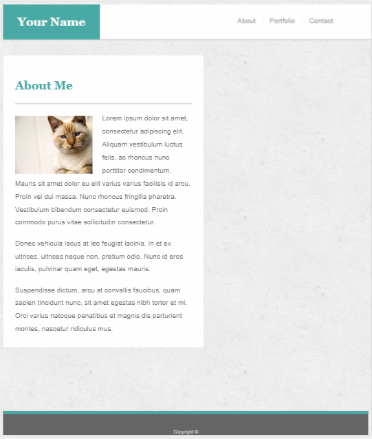
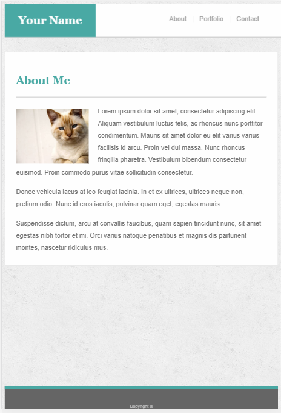
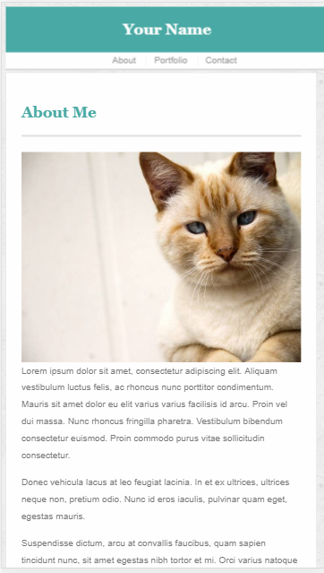

# Responsive-Portfolio

Desktop view at 960px

Tablet view at 768px

Phone landscape view at 640px

Using media queries in CSS to rearrange elements based on window size.

## Getting Started

The Portfolio starts with the index.html, which is the main About Me content. The nav on the top right links all three html sites.

You will need all of the files in this repository (except git) for it all to work properly.

### Prerequisites

In order to see specific sizes, browser development tools are required to adjust specific sizes, however resizing the browser window itself works just as well.

## Deployment
If hosting on a remote server, placing the html files and folders in your web directory is the only step required. 

If local, open the index.html file with your preferred browser.

You may use either or to adjust the page size:
1. Open the dev tools (Chrome: ctrl+shift+i and hit the tablet icon next to the pointer icon on the top left)

2. Dragging the right or left side of the window to decrease or increase the total width, switching between phone, tablet, and desktop media query sizes.

## Built With

* HTML 
* CSS 
* [Media Queries](https://www.w3schools.com/css/css_rwd_mediaqueries.asp)

## Authors

* **Esar Behlum** 